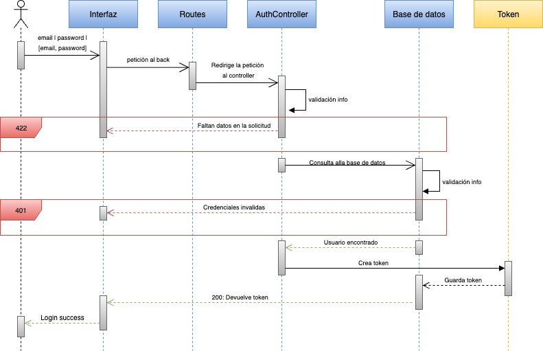

# 🍽️ Restaurant API - Back

Una API RESTful desarrollada en Laravel para la gestión de restaurantes. Incluye operaciones CRUD completas, autenticación con Laravel Sanctum, documentación automática con Swagger y pruebas automatizadas.

## 📋 Características

- ✅ **CRUD completo** de restaurantes (Crear, Leer, Actualizar, Eliminar)
- 🔐 **Autenticación segura** con Laravel Sanctum
- 📚 **Documentación automática** con Swagger/OpenAPI
- 🧪 **Tests automatizados** con PHPUnit
- 🗄️ **Base de datos** desplegada en Amazon RDS
- 🐳 **Containerización** con Docker
- 🎨 **Frontend** desarrollado en React

## 📊 Arquitectura y Diagramas

### Diagrama de Secuencia - Proceso de Autenticación


### 📖 Documentación de la API
La documentación interactiva está disponible en:
https://restaurantsapi-back-1.onrender.com/api/documentation

## 📁 Estructura del Proyecto

```
restaurantsapi-back/
├── app/
│   ├── Http/
│   │   ├── Controllers/
│   │   │   ├── AuthController.php       # Controlador de autenticación
│   │   │   └── RestaurantController.php # Controlador de restaurantes
│   │   ├── Middleware/
│   │   └── Requests/
│   ├── Models/
│   │   ├── Restaurant.php               # Modelo de restaurante
│   │   └── User.php                     # Modelo de usuario
│   └── Providers/
├── bootstrap/
│   └── cache/                           # Cache de Laravel
├── config/
│   ├── auth.php                         # Configuración de autenticación
│   ├── cors.php                         # Configuración CORS
│   ├── database.php                     # Configuración de base de datos
│   └── sanctum.php                      # Configuración de Sanctum
├── database/
│   ├── factories/
│   │   ├── RestaurantFactory.php        # Factory de restaurantes
│   │   └── UserFactory.php              # Factory de usuarios
│   ├── migrations/
│   │   ├── create_users_table.php       # Migración de usuarios
│   │   ├── create_restaurants_table.php # Migración de restaurantes
│   │   └── create_personal_access_tokens_table.php
│   └── seeders/
│       ├── DatabaseSeeder.php           # Seeder principal
│       ├── UserSeeder.php               # Seeder de usuarios
│       └── RestaurantSeeder.php         # Seeder de restaurantes
├── public/
│   └── index.php                        # Punto de entrada
├── routes/
│   ├── api.php                          # Rutas de la API
│   └── web.php                          # Rutas web
├── storage/
│   ├── app/
│   ├── framework/
│   └── logs/                            # Logs de la aplicación
├── tests/
│   ├── Feature/
│   │   ├── ApiTest.php                  # Tests CRUD de restaurantes
│   │   └── LoginTest.php                # Tests de autenticación
│   └── Unit/
├── vendor/                              # Dependencias de Composer
├── .env.example                         # Variables de entorno de ejemplo
├── .gitignore
├── composer.json                        # Dependencias PHP
├── Dockerfile                           # Imagen Docker
├── phpunit.xml                          # Configuración de tests
└── README.md                            # Este archivo
```

## 🏗️ Instalación

### Opción 1: Con Docker (Recomendado)

```bash
# Clonar el repositorio
git clone https://github.com/donatomarino/restaurantsapi-back.git
cd restaurantsapi-back

# Configurar variables de entorno
cp .env.example .env
# Editar .env con tus configuraciones de base de datos

# Construir imagen
docker build -t laravel-apirestaurants:1.0.0 .

# Ejecutar contenedor
docker run -d \
  --name restaurant-api \
  -p 8000:80 \
  --env-file .env \
  laravel-apirestaurants:1.0.0

# Generar APP_KEY (OBLIGATORIO)
docker exec restaurant-api php artisan key:generate

# Ejecutar migraciones y seeders
docker exec restaurant-api php artisan migrate --seed

# Optimizar para producción (opcional)
docker exec restaurant-api php artisan config:cache
docker exec restaurant-api php artisan route:cache
```

## 🧪 Testing

### Ejecutar todos los tests
```bash
# Local
php artisan test

# Con Docker
docker exec -it restaurantsapi-back php artisan test

# Con coverage
php artisan test --coverage
```

### Tests incluidos
- ✅ **Autenticación:** Login exitoso, credenciales inválidas, validaciones
- ✅ **Restaurantes CRUD:** Crear, listar, actualizar, eliminar
- ✅ **Validaciones:** Campos obligatorios, duplicados, formatos
- ✅ **Autorización:** Acceso sin token, tokens inválidos
- ✅ **Errores:** Manejo de errores 404, 422, 500

## 🗄️ Base de Datos

### Amazon RDS
- **Motor:** MySQL 8.0
- **Instancia:** db.t3.micro (Free Tier)
- **Almacenamiento:** 20GB SSD
- **Backup:** Automático (7 días)
- **Multi-AZ:** Habilitado para alta disponibilidad

## 🛡️ Notas de Seguridad

- ✅ **Autenticación:** Laravel Sanctum con tokens seguros
- ✅ **Validación:** Validación de entrada en todos los endpoints
- ✅ **CORS:** Configurado para dominios específicos
- ✅ **Permisos:** Los directorios `storage` y `bootstrap/cache` configurados para Apache
- ✅ **Variables sensibles:** Revisar y ajustar las variables en `.env` antes de producción

## 🤝 Contribución

1. Fork el proyecto
2. Crea tu rama de feature (`git checkout -b feature/AmazingFeature`)
3. Commit tus cambios (`git commit -m 'Add some AmazingFeature'`)
4. Push a la rama (`git push origin feature/AmazingFeature`)
5. Abre un Pull Request

## 📝 Licencia

Este proyecto está bajo la Licencia MIT. Ver el archivo `LICENSE` para más detalles.

## 👨‍💻 Autor

**Donato Marino**