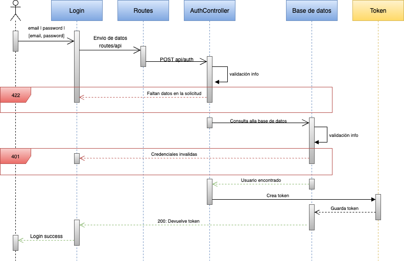

# 🍽️ Restaurant API - Back

Una API RESTful desarrollada en Laravel para la gestión de restaurantes. Incluye operaciones CRUD completas, autenticación con Laravel Sanctum, documentación automática con Swagger y pruebas automatizadas.

## 🚀 Despliegue

- **URL:** https://restaurantsapi-front.vercel.app/

## 📋 Características

- ✅ **CRUD completo** de restaurantes (Crear, Leer, Actualizar, Eliminar)
- 🔐 **Autenticación segura** con Laravel Sanctum y **Rate Limiting** para proteger la API
- 📝 **Validación de datos** con mensajes personalizados
- 📚 **Documentación automática** con Swagger/OpenAPI
- 🧪 **Tests automatizados** con PHPUnit
- 🗄️ **Base de datos** en PostgreSQL
- 🐳 **Containerización** con Docker
- 🎨 **Frontend** desarrollado en React
- 🛡️ **Manejo centralizado de excepciones**
- 📱 **Validación avanzada de teléfonos españoles**

## 📊 Arquitectura y Diagramas

### Diagrama de Secuencia - Proceso de Autenticación


Este diagrama ilustra el flujo completo de autenticación implementado con Laravel Sanctum, incluyendo:

- ✅ Validación de campos obligatorios
- ✅ Verificación de credenciales en base de datos
- ✅ Generación de tokens seguros
- ✅ Manejo de errores (422, 401)
- ✅ Respuestas JSON estructuradas

### 📖 Documentación de la API
La documentación completa con Swagger está disponible en:
https://restaurantsapi-back-1.onrender.com/api/documentation

#### 🔐 Autenticación Requerida
Para realizar llamadas a la API protegida, primero necesitas obtener un token de autenticación:

**Credenciales de prueba:**
- **Email:** `donato@test.com`
- **Password:** `test1234`

### 📞 Validación de Teléfonos
Se ha implementado validación avanzada de números de teléfono usando el paquete `propaganistas/laravel-phone`:

```php
'phone' => 'required|phone:ES'
```

**Formatos soportados:**
- ✅ **España (ES):** `+34 915 123 456`, `957 71 9926`, `982 883878`

## 🛡️ Rate Limiting

La API implementa límites de velocidad para proteger contra abuso:

- **Autenticación (`/api/auth`):** 5 intentos por minuto por IP
- **APIs autenticadas:** 60 requests por minuto por usuario

## 📋 Códigos de Respuesta

| Código | Descripción |
|--------|-------------|
| `200` | Éxito |
| `201` | Recurso creado |
| `401` | No autenticado / Credenciales inválidas |
| `404` | Recurso no encontrado |
| `409` | Conflicto (recurso duplicado) |
| `422` | Errores de validación |
| `429` | Rate limit excedido |
| `500` | Error interno del servidor |

## 🔧 Manejo de Excepciones

La API utiliza un sistema centralizado de manejo de excepciones:

```
app/
├── Exceptions/
│   ├── ApiException.php            # Manejo centralizado de todas las excepciones
│   └── RequestValidationException.php       # Excepción personalizada para errores de API
```

**Todas las respuestas de error siguen el formato:**
```json
{
  "success": false,
  "message": "Descripción del error",
  "error": true
}
```

## 📁 Estructura del Proyecto

```
restaurantsapi-back/
├── app/
│   ├── Http/
│   │   ├── Controllers/
│   │   │   ├── AuthController.php       # Controlador de autenticación
│   │   │   └── RestaurantController.php # Controlador de restaurantes
│   │   ├── Middleware/
│   │   └── Requests/
│   ├── Models/
│   │   ├── Restaurant.php               # Modelo de restaurante
│   │   └── User.php                     # Modelo de usuario
│   ├── Exceptions/
│   │   ├── Handler.php                  # Manejo centralizado de excepciones
│   │   └── ApiException.php             # Excepción personalizada para errores de API
│   ├── Docs/
│   │   └── LoginApi.php                 # Documentación Swagger del login
│   └── Providers/
├── bootstrap/
│   ├── cache/                           # Cache de Laravel
│   └── providers.php                    # Registro de providers (Laravel 11+)
├── config/
│   ├── auth.php                         # Configuración de autenticación
│   ├── cors.php                         # Configuración CORS
│   ├── database.php                     # Configuración de base de datos
│   ├── sanctum.php                      # Configuración de Sanctum
│   └── l5-swagger.php                   # Configuración de Swagger
├── database/
│   ├── factories/
│   │   ├── RestaurantFactory.php        # Factory de restaurantes
│   │   └── UserFactory.php              # Factory de usuarios
│   ├── migrations/
│   │   ├── 0001_01_01_000000_create_users_table.php       # Migración de usuarios
│   │   ├── 0001_01_01_000001_create_cache_table.php       # Migración de cache
│   │   ├── 0001_01_01_000002_create_jobs_table.php        # Migración de jobs
│   │   ├── xxxx_xx_xx_xxxxxx_create_restaurants_table.php # Migración de restaurantes
│   │   └── xxxx_xx_xx_xxxxxx_create_personal_access_tokens_table.php # Sanctum tokens
│   └── seeders/
│       ├── DatabaseSeeder.php           # Seeder principal
│       ├── UserSeeder.php               # Seeder de usuarios
│       └── RestaurantSeeder.php         # Seeder de restaurantes
├── docs/
│   └── diagrama_secuencia_login.png     # Diagrama de autenticación
├── public/
│   ├── index.php                        # Punto de entrada
│   └── docs/                            # Documentación Swagger generada
├── routes/
│   ├── api.php                          # Rutas de la API
│   ├── web.php                          # Rutas web
│   └── console.php                      # Comandos Artisan
├── storage/
│   ├── app/
│   │   ├── public/
│   │   └── private/
│   ├── framework/
│   │   ├── cache/
│   │   ├── sessions/
│   │   └── views/
│   └── logs/
│       └── laravel.log                  # Logs de la aplicación
├── tests/
│   ├── Feature/
│   │   ├── ApiTest.php                  # Tests CRUD de restaurantes
│   │   └── LoginTest.php                # Tests de autenticación
│   ├── Unit/
│   ├── TestCase.php                     # Clase base para tests
│   └── CreatesApplication.php           # Helper para tests
├── vendor/                              # Dependencias de Composer
├── .env.example                         # Variables de entorno de ejemplo
├── .env                       ∫          # Variables de entorno (no versionado)
├── .gitignore                           # Archivos ignorados por Git
├── artisan                              # CLI de Laravel
├── composer.json                        # Dependencias y scripts PHP
├── composer.lock                        # Lock de versiones exactas
├── Dockerfile                           # Imagen Docker
├── phpunit.xml                          # Configuración de tests PHPUnit
└── README.md                            # Este archivo
```

## 🏗️ Instalación local

### 1. Requisitos del sistema

- PHP 8.1 o superior
- Node.js 18 o superior
- MySQL 8.0 o superior (o PostgreSQL/SQLite)
- Composer
- npm (incluido con Node.js)

---

### 2. Preparación del proyecto

1. Clona el proyecto:

```bash
git clone https://github.com/donatomarino/restaurantsapi-back.git
cd restaurantsapi-back
```

---

### 3. Instalación del backend (Laravel)

1. Accede al backend:

```bash
cd restaurantsapi-back
```

2. Instala las dependencias:

```bash
composer install
```

3. Crea el archivo `.env`:

```bash
cp .env.example .env
```

4. Configura el archivo `.env`:

Abre `.env` y asegúrate de que los valores principales estén así (ajusta los nombres según tu base de datos):

```env
APP_NAME=RestaurantsAPI
APP_ENV=local
APP_DEBUG=true
APP_URL=http://localhost

DB_CONNECTION=pgsql
DB_HOST=127.0.0.1
DB_PORT=5432
DB_DATABASE=restaurantsapi
DB_USERNAME=postgres
DB_PASSWORD=
```

> Nota: si usas MySQL, cambia `DB_CONNECTION=mysql`, `DB_PORT=3306`, `DB_USERNAME=root` y ajusta `DB_PASSWORD` según tu entorno.

5. Genera la clave de la aplicación:

```bash
php artisan key:generate
```

6. Ejecuta migraciones y seeders:

```bash
php artisan migrate --seed
```

7. Crea el enlace simbólico de almacenamiento:

```bash
php artisan storage:link
```

8. Inicia el servidor del backend:

```bash
php artisan serve
```

### Tests incluidos
- ✅ **Autenticación:** Login exitoso, credenciales inválidas, validaciones
- ✅ **Restaurantes CRUD:** Crear, listar, actualizar, eliminar
- ✅ **Validaciones:** Campos obligatorios, duplicados, formatos
- ✅ **Autorización:** Acceso sin token, tokens inválidos
- ✅ **Errores:** Manejo de errores 404, 422, 500

## 🗄️ Base de Datos

### PostgreSQL
- **Motor:** PostgreSQL
- **Puerto:** 5432
- **Entorno recomendado:** local, Docker, Neon, Supabase o cualquier instancia PostgreSQL
- **Backup y persistencia:** según la infraestructura elegida

## 🛡️ Notas de Seguridad

- ✅ **Autenticación:** Laravel Sanctum con tokens seguros
- ✅ **Validación:** Validación de entrada en todos los endpoints
- ✅ **CORS:** Configurado para dominios específicos
- ✅ **Permisos:** Los directorios `storage` y `bootstrap/cache` configurados para Apache
- ✅ **Variables sensibles:** Revisar y ajustar las variables en `.env`

## 👨‍💻 Autor

**Donato Marino**


